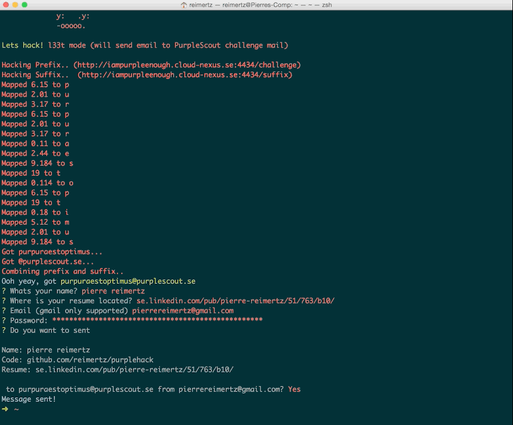

purplehack
=====

purplehack is a command-line inteface the purplescout hack.

I has three modes
* simple mode - just retrieves challenge email
* hack mode - give some info about how the email is retrieved.
* l33t mode - Retrieve challenge email + send personalized email to it. 

##Installation
```javascript
npm install -g purplehack
```

##Usage
```javascript
purplehack (press enter)
```
##Demo
